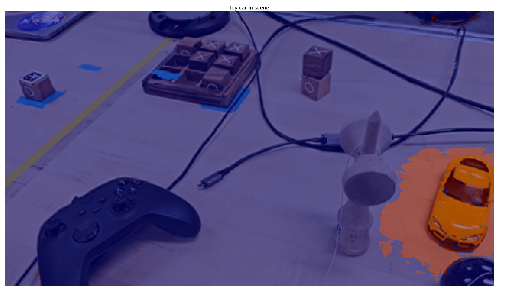
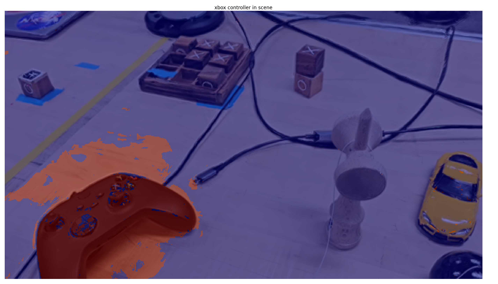
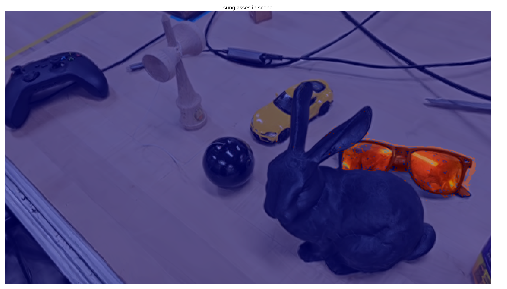

# 🐇 3D-LECoP
3D Language Embedded Consistency Policy


This work presents 3D Language Embedded Consistency Policy, a method for using language embeddings and Gaussian Splatting to learn a Consistency Policy. 

## Quickstart
This repository relies on two repos: a forked version of [LEGaussians](https://github.com/peasant98/LEGaussians) and [Consistency Policy](https://github.com/Aaditya-Prasad/Consistency-Policy/). We currently have most of the perception side of the pipeline working.
To get it setup, we have created a single shell script that will take care of dependencies.


```sh
bash perception.sh

```

After this, refer to LEGaussians for more steps on how to run.

The robot policy side of this project is not complete. Setup consists of following [Consistency Policy](https://github.com/Aaditya-Prasad/Consistency-Policy/) to setup the robomimic environment.


## Example Gaussian Splatting Renderings with LEGaussian

Below are some masked out examples of LEGaussian on a real world scene that a robot might be asked to work in.

Toy Car


Xbox controller




Sunglasses
